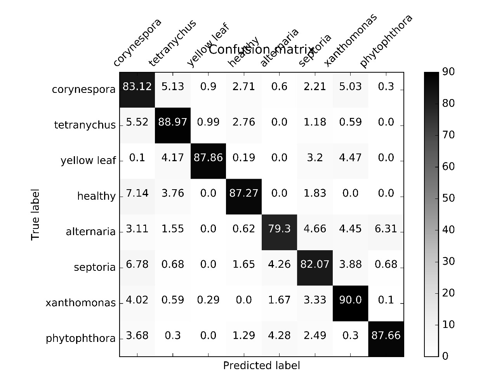

## Tomato diseases classifier model  

### Parameters used   
    learning rate: 0.01  
    how many images: 1400  
    test percentage: 10%  
    validation percentage: 10%  
    how many steps: 4000  
    architecture: inceptionv3  
    train batch size: 100  
    test batcch size: -1  
    any distortions: N/A  
 
### Output classes  
    Corynespora 
    tetranychus 
    yelow leaf 
    health 
    alternaria 
    septoria 
    xanthomonas 
    phytophthora 

### Final test accuracy  
    90.7%
     
### Plot of confusion matrix  

  

